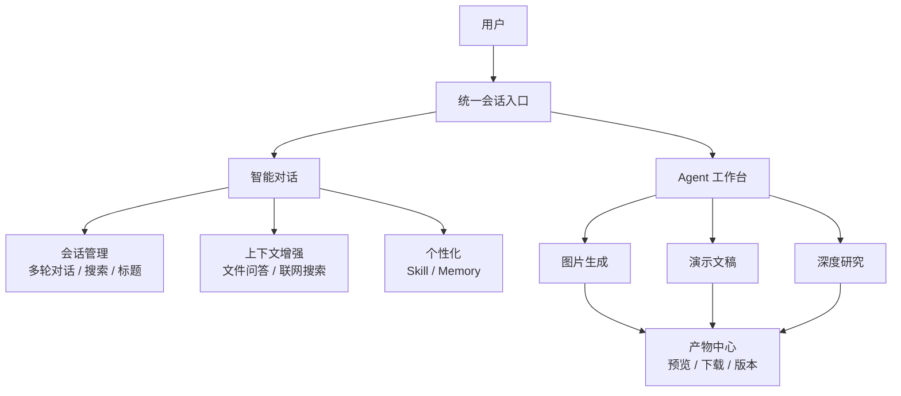
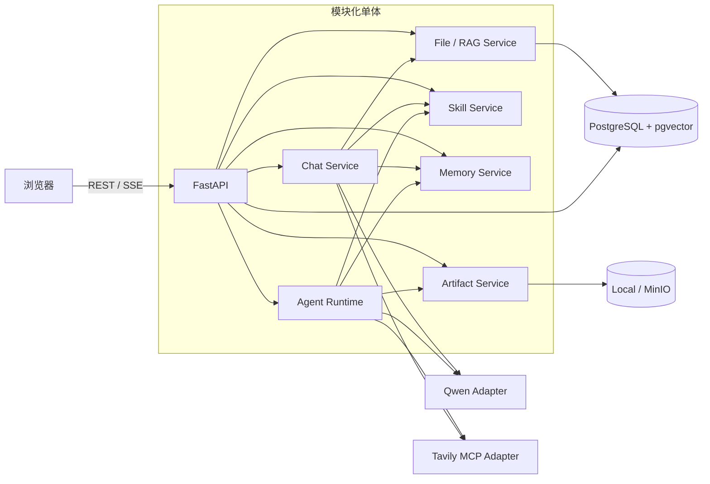

# Intelligence Hub 架构说明

> 面向个人项目的 MVP 架构  
> 更新日期：2026-08-13

## 第一部分：业务架构

### 1.1 业务目标与边界

Intelligence Hub 面向项目开发者本人，是一个参考 ChatGPT Web 交互方式的个人 Agent Hub。MVP 只验证两个核心目标：

1. 提供顺手、可持续的多轮对话体验。
2. 让用户在同一个会话界面中调用 Agent，并获得可查看、可下载、可追溯的产物。

首版包含普通对话、文件问答、联网搜索、Skill、Memory，以及图片生成、演示文稿和深度研究三个内置 Agent。不包含多人协作、企业权限、第三方市场、任意代码执行和大规模并发能力。

### 1.2 业务入口

用户始终从会话进入业务流程，并通过模式区分即时问答与产物型任务。

| 模式 | 使用目的 | 输入 | 输出 | 约束 |
| --- | --- | --- | --- | --- |
| Chat | 普通问答、文件问答、联网搜索 | 文本、可选文件、可选 Skill | 流式回答、来源、推荐问题 | 不允许携带 `agent_type` |
| Work | 执行图片、演示或研究任务 | 任务描述、Agent 类型、可选文件或 Skill | 阶段进度、最终回答、产物 | 必须选择一个有效 Agent |

### 1.3 业务能力



业务能力分为五组：

- 会话与交互：创建、切换、重命名、删除和搜索会话，支持多轮流式对话、停止和重新生成。
- 上下文增强：上传文件并基于文件问答；在用户明确要求时联网搜索并展示真实来源。
- Agent 工作台：统一启动图片、演示和研究任务，展示思考内容、工具调用、公开阶段与错误。
- 个性化：管理 Skill 和用户记忆摘要；每次请求选择并快照 Skill，同时注入完整记忆摘要。
- 产物管理：将图片、PPTX 和 Markdown 报告绑定到会话与运行，支持刷新后查看和下载。

### 1.4 核心业务流程

#### 1.4.1 Chat 流程

```text
创建或进入会话 -> 输入问题 -> 选择可选文件或 Skill
               -> 组装相关上下文 -> 流式生成回答
               -> 保存消息与来源 -> 生成标题和推荐问题
```

- `txt`、`md`、`pdf`、`docx` 的短文本全文加入上下文，长文本分块检索；图片作为多模态内容直接送入支持视觉输入的模型，不进入文本向量检索；引用只能来自本轮实际使用的文件或检索结果。
- 只有用户明确提出联网需求时才调用 Tavily，回答中展示可访问的来源链接。
- 首轮回答完成后生成会话标题；用户手动改名后不再自动覆盖。
- 推荐问题位于回答、来源和产物信息之后，点击后只填入输入框。

#### 1.4.2 Work 流程

```text
进入 Work -> 选择 Agent -> 提交任务 -> 创建运行
          -> 展示阶段与工具调用 -> 生成并登记产物
          -> 在当前会话中预览或下载
```

三个 Agent 的业务流程如下：

- 图片生成：读取可选参考图 -> 理解需求 -> 生成图片 -> 校验结果 -> 保存图片。
- 演示新建：生成大纲 -> 用户确认 -> 生成页面 -> 渲染 PPTX -> 保存版本。
- 演示修改：选择源版本 -> 生成修改计划 -> 生成新版本 -> 校验非目标内容 -> 保存产物。
- 演示恢复：读取最近检查点 -> 跳过已完成阶段 -> 继续执行 -> 避免重复产物。
- 深度研究：拆解问题 -> 搜索与提取 -> 整理证据 -> 校验引用 -> 保存 Markdown 报告。

#### 1.4.3 Skill 与 Memory 流程

- Skill：用户显式选择 `@Skill`，或系统从已启用项中选择至多一个；发送时生成不可变快照，后续编辑不影响历史请求。
- Memory：明确的“记住/忘记”命令立即更新单份用户记忆摘要；会话闲置 30 分钟后仅提炼稳定、低风险信息；每轮将整份摘要注入 System Prompt。

### 1.5 核心业务对象

| 业务对象 | 含义 | 主要关系 |
| --- | --- | --- |
| 会话 `Conversation` | 用户持续交互的业务容器，固定属于 Chat 或 Work | Chat 包含消息，Work 包含 Agent 运行；两者不复用会话 |
| 消息 `Message` | 一次用户输入或助手回答 | 属于会话，可关联 Skill 快照 |
| 文件 `File` | 用户提供的问答资料 | 属于会话，可产生检索片段 |
| Skill | 可管理、可复用的任务指令 | 请求使用其不可变快照 |
| Memory | 跨会话复用的用户记忆摘要 | 记录最近来源，可启停、编辑或清空 |
| Agent 运行 `AgentRun` | 一次 Work 任务的执行记录 | 属于会话，产生零个或多个产物 |
| 产物 `Artifact` | 图片、PPTX 或 Markdown 报告 | 属于运行，可形成版本链 |

消息与 Agent 运行采用一致、可理解的生命周期：

```text
消息：pending -> streaming -> completed
                          \-> failed
                          \-> cancelled

运行：queued -> running -> completed
                    \-> failed
                    \-> cancelled
```

### 1.6 业务规则

- Chat 不能启动 Agent；Work 必须指定图片、演示或研究 Agent。
- Chat 与 Work 会话显示在同一个会话列表中；选择模式时只建立前端草稿状态，用户发送第一句话后才以该内容命名并持久化会话。会话模式之后不可切换，两者的上下文和文件空间独立，服务端拒绝跨模式写入。
- 思考内容仅展示模型接口实际返回的 reasoning/thinking，不补写或伪造。
- 工具调用只展示脱敏、截断后的参数和结果摘要。
- 产物必须与运行和会话绑定；演示修改必须保留原版本并生成新版本。
- 演示恢复不得重复执行已完成阶段或生成重复产物。
- 研究任务受搜索次数和总耗时限制，报告引用必须能够追溯到实际证据。
- Skill 与 Memory 都不能扩大工具权限，也不能覆盖系统安全规则。
- 自动 Memory 不保存密码、密钥、支付信息等高敏感内容；存在冲突或歧义时不自动覆盖。

## 第二部分：技术架构

技术架构只服务于上述 MVP 业务目标。首版采用模块化单体，先跑通主流程，再根据真实负载拆分服务。

设计原则：

- Chat 与长任务共用一套 API、事件协议和核心数据模型。
- 外部模型、搜索和存储通过适配器接入，方便替换。
- 服务端保存事实状态，前端只维护展示状态和草稿。
- 副作用操作具备幂等边界，支持安全重试和阶段恢复。
- 密钥不下发到浏览器。

### 2.1 技术选型

| 层级 | 选型 | 用途 |
| --- | --- | --- |
| Web | Vue 3 + TypeScript + Vite | 页面、对话流、Agent 选择与产物预览 |
| 路由与状态 | Vue Router + Pinia | 页面路由、草稿和流式状态 |
| API | FastAPI | REST、SSE、文件上传和任务控制 |
| 普通对话 | LangChain | Prompt、模型、文件检索和工具调用 |
| 图片 Agent | LangChain | 结构化图片需求、受控工具调用和图片生成 |
| 演示 Agent | LangGraph + LangChain | LangGraph 管阶段、确认、版本和恢复；LangChain 管节点内模型调用 |
| 研究 Agent | LangGraph + Deep Agents | 外层 LangGraph 管边界和校验；Deep Agents 管自主研究 |
| 模型 | 阿里云百炼千问 | 文本、推理、视觉理解、向量和图片生成 |
| 联网 | Tavily MCP | 搜索和网页提取 |
| 数据库 | PostgreSQL + pgvector | 会话、消息、运行记录和向量 |
| 文件 | 本地目录；需要时切换 MinIO | 上传文件、图片、PPTX 和报告 |
| 调试 | 结构化日志；可选 LangSmith | 本地排错和 Agent Trace |

MVP 不要求 Redis、Celery、OpenTelemetry 或独立 Worker 集群。长任务先由同一 Python 应用中的后台执行器运行；演示 Agent 使用 PostgreSQL 持久化 LangGraph 检查点，应用重启后由用户手动恢复。并发成为真实问题时，再拆分 Worker 和队列。

### 2.2 总体结构



部署时只需要三个单元：

- `web`：Vue 静态站点。
- `api`：FastAPI，同时承载 Chat 和首版后台任务。
- `postgres`：主数据与向量索引。

对象存储使用本地目录即可启动；需要容器化或远程访问时增加 MinIO。

### 2.3 代码结构建议

```text
frontend/
├── src/pages/          # Chat、Agents、Settings
├── src/features/       # 消息流、上传、Agent Run
├── src/components/     # 通用 UI
└── src/lib/            # API、SSE、Markdown

backend/
├── app/api/            # FastAPI 路由与 schema
├── app/chat/           # 普通对话编排
├── app/files/          # 解析、分块、检索
├── app/skills/         # Skill 管理、选择与快照
├── app/memory/         # 用户记忆摘要管理、命令与闲置提炼
├── app/agents/         # 三个 Agent 与共享运行时
├── app/artifacts/      # 产物存储和下载
├── app/integrations/   # Qwen、Tavily、存储适配器
└── app/db/             # 模型、查询与迁移
```

模块之间通过 Python 接口调用，不在 MVP 中引入内部 RPC。

### 2.4 核心模块

#### 2.4.1 Chat Service

职责：

- 创建用户消息和助手消息。
- 组装近期会话、文件片段和本轮允许的工具。
- 调用文本模型并通过 SSE 分别推送思考内容与最终回答。
- 记录工具调用的开始、完成、失败、耗时以及安全化的输入/输出摘要。
- 处理停止、失败和重新生成。
- 首轮完成后生成会话标题，并在每条完成回答末尾生成推荐问题。
- 按标题和消息正文搜索会话，返回命中摘要。
- 解析显式 `@Skill`，或从启用的 Skill 名称和描述中选择至多一个。
- 每轮注入完整用户记忆摘要，并处理明确的“记住/忘记”命令。

消息状态保持简单：

```text
pending -> streaming -> completed
                    \-> failed
                    \-> cancelled
```

Chat 请求不能携带 `agent_type`；Work 请求必须携带有效的 `agent_type`。服务端进行最终校验，不能只依赖前端显隐。

自动标题只在会话仍为默认标题时运行，用户手动改名会把 `title_source` 设为 `manual`。推荐问题在正文、来源与产物事件之后生成并保存为 `follow_up` 内容块；模型生成失败时使用当前主题生成安全的确定性兜底问题，不改变主回答的完成状态。会话搜索首版使用 PostgreSQL 大小写不敏感的关键词匹配覆盖标题与消息正文，数据规模增长后再引入专用全文索引。

#### 2.4.2 File / RAG Service

首版处理流程：

```text
上传 -> 格式与内容校验
     -> 文档（txt/md/pdf/docx）-> 文本提取 -> 短文全文 / 长文分块向量化 -> 可用
     -> 图片（png/jpg/jpeg/webp）-> 解码与尺寸校验 -> 多模态输入 / Agent 参考图 -> 可用
```

- 文档支持 `txt`、`md`、`pdf`、`docx`；图片支持 `png`、`jpg`、`jpeg`、`webp`。
- 扩展名、声明的 MIME 和文件魔数必须一致；图片解码后还需限制像素尺寸，避免解压炸弹。
- 以提取后的文本长度决定全文或检索模式，阈值放入配置。
- 分块保存 `file_id`、文本、页码或字符范围和向量。
- 检索结果只能来自当前会话已选择的文件。
- 模型回答中的文件引用由检索结果生成，不让模型自行编造定位。
- 图片不执行 OCR 或文本向量化；Chat 将本轮所选图片作为多模态消息内容提交，图片 Agent 将所选图片作为受控参考输入。
- 消息和 Agent 运行分别保存实际使用的文件关联，以便刷新、重新生成和恢复时复现原始输入。

#### 2.4.3 Skill Service

Skill Service 提供名称、描述、指令和启停状态的 CRUD。每次请求只向路由模型提供已启用 Skill 的名称与描述；选中后才加载完整指令。合法的显式 `@Skill` 优先，未显式指定时模型可以返回至多一个 `skill_id` 候选，服务端复验后使用。

发送消息或启动 Work 时创建不可变 Skill 快照，并将快照 ID 绑定本次消息或运行。Skill 停用、编辑或删除只影响后续请求，不改变历史记录。

#### 2.4.4 Memory Service

Memory Service 管理单份用户记忆摘要、启停状态和最近更新来源：

- 用户明确要求“记住/忘记”时，同步执行变更并返回结果。
- 会话最后活动满 30 分钟后，应用内周期任务提炼新增内容；应用重启后根据 `last_activity_at` 和提炼游标补扫到期会话。
- 自动提炼只保存稳定、低风险的偏好和背景；敏感、含糊或冲突内容不自动写入。
- Chat 每轮将整份用户记忆摘要作为独立的低优先级 System Prompt 上下文注入；Work 运行也复用同一摘要。
- Memory 关闭时停止提炼、写入和注入；已有数据保留，删除后立即不再使用。

#### 2.4.5 Agent Runtime

Agent Runtime 与具体编排框架解耦，统一使用 `agent_runs` 记录 Agent 类型、输入、状态、公开阶段、思考内容、工具调用、错误和产物。图片、演示和研究实现相同的运行接口并输出相同的事件协议，但不强制使用同一种内部框架。

```text
queued -> running -> completed
                 \-> failed
                 \-> cancelled
```

三个 Agent 的首版流程和框架边界如下。

##### 图片 Agent：LangChain

```text
读取可选参考图 -> 理解输入 -> 生成结构化 ImageBrief -> 调用图片生成工具 -> 校验结果 -> 保存图片
```

- 使用 LangChain 统一 Qwen 多模态消息、结构化输出和工具定义；参考图只能来自当前运行已关联且校验通过的上传图片。
- Agent 只开放图片生成所需的受控工具，并设置较小的最大迭代次数；首版不提供任意文件操作、子 Agent 或开放式工具循环。
- 图片生成不要求 LangGraph 检查点；阶段、失败和重试仍通过通用 Agent Runtime 记录。
- 演示 Agent 需要图片资产时，直接复用图片 Agent 的 LangChain Runnable 或服务接口，并把生成结果登记为演示运行的关联产物。

##### 演示 Agent：LangGraph + LangChain

```text
识别意图 -> CREATE / MODIFY / RESUME
         -> 大纲或修改计划 -> 等待确认 -> 页面内容 -> 图片资产
         -> 渲染 PPTX -> 校验 -> 保存新版本
```

- LangGraph 是顶层编排器，负责分支、公开阶段、人工确认、中断、检查点和恢复。
- LangChain 用于图节点内的模型调用与结构化输出，包括 `PresentationOutline`、`SlideContent`、`ModificationPlan`、`AssetRequest` 和 `ValidationResult`。
- 大纲确认使用图中断；恢复后可能重新进入当前节点，因此图片生成、PPTX 渲染和产物登记必须幂等。
- `CREATE` 生成新演示；`MODIFY` 必须指定源版本并生成新版本；`RESUME` 必须绑定原运行。阶段副作用使用 `run_id + stage + input_hash` 作为幂等键，避免恢复时重复生成产物。

##### 研究 Agent：LangGraph + Deep Agents

```text
外层 LangGraph：准备任务 -> Deep Agents 研究子图 -> 证据与引用校验
              -> 必要时修复 -> 保存 Markdown

Deep Agents：研究规划 -> 搜索与提取 -> 必要的固定子 Agent 委派
            -> 证据整理 -> 结构化报告草稿
```

- 外层 LangGraph 是业务状态的唯一顶层所有者，负责搜索次数、总耗时、取消、公开阶段、证据校验、引用校验和最终产物登记。
- Deep Agents 只负责开放式研究工作，包括问题拆解、计划调整、Tavily 搜索、网页提取、上下文管理、证据整理和报告草拟。
- Deep Agents 不直接写业务数据库、不登记 Artifact，也不能绕过搜索和时间预算；Tavily 工具适配器必须在所有主 Agent 和子 Agent 调用上共享计数与截止时间。
- Deep Agents 返回结构化 `ResearchResult`，至少包含报告章节、证据列表、引用关系和未解决问题；外层图复验 URL 与引用关系后才保存 Markdown。
- 首版允许研究 Agent 内部使用预先注册、工具受限的固定子 Agent，不支持用户创建任意子 Agent，也不实现三个产品 Agent 之间的自主协作。

框架组合关系为：LangChain 提供模型与工具抽象；LangGraph 提供显式状态和编排；Deep Agents 作为研究图中的自主研究 Harness。Deep Agents 的内部执行细节不得成为前端或业务数据模型的直接依赖，具体业务流程以 1.4.2 节为准。

演示 Agent 使用 PostgreSQL LangGraph checkpointer 保存内部状态，并以 `run_id` 作为顶层 `thread_id`。`agent_runs.stage` 保存供 UI 使用的公开阶段；`run_checkpoints` 只保存公开阶段到 LangGraph `checkpoint_id` 的索引，不重复保存完整图状态。研究 Agent 首版不承诺中断后恢复其内部 Deep Agents 推理过程，只从外层图已提交的业务阶段重试。

#### 2.4.6 Artifact Service

统一管理图片、PPTX 和 Markdown 报告。数据库只保存元数据和存储路径，文件内容进入本地目录或 MinIO。

产物至少包含：

- `id`、`run_id`、`type`、`name`
- `storage_key`、`mime_type`、`size`
- `created_at`

下载必须经过 API 校验；MinIO 模式使用短期预签名 URL。

#### 2.4.7 外部服务适配器

- `QwenAdapter`：向 LangChain 和 Deep Agents 提供兼容的模型实例，并统一文本流式、视觉理解、结构化输出、Embedding 和图片生成接口。
- `TavilyAdapter`：以受控工具形式向 LangChain 和 Deep Agents 开放搜索与提取，返回统一的标题、URL、摘要结构；研究运行中的所有调用共享预算计数与截止时间。
- `StorageAdapter`：提供保存、读取和删除；实现 Local 与 MinIO 两种后端。

具体模型 ID、地域、超时和限额均从环境配置读取。适配器应保留供应商错误码，但对前端返回安全、易懂的错误信息。

### 2.5 最小数据模型

| 表 | 关键字段 |
| --- | --- |
| `conversations` | `id`、`mode`、`title`、`title_source`、`last_activity_at`、`memory_cursor`、`created_at`、`updated_at` |
| `messages` | `id`、`conversation_id`、`role`、`mode`、`skill_snapshot_id`、`content`、`status`、`created_at` |
| `message_parts` | `id`、`message_id`、`seq`、`type`、`content`；按顺序保存 `reasoning`、`text` 等内容块 |
| `tool_calls` | `id`、`message_id`、`run_id`、`tool_name`、`input_summary`、`output_summary`、`status`、`duration_ms` |
| `skills` | `id`、`name`、`description`、`instructions`、`enabled`、`updated_at` |
| `skill_snapshots` | `id`、`skill_id`、`name`、`description`、`instructions`、`content_hash` |
| `memory_summaries` | 固定 `id=1`、`content`、`source`、`source_conversation_id`、`created_at`、`updated_at` |
| `app_settings` | `memory_enabled`、`web_search_enabled`、外观设置 |
| `files` | `id`、`conversation_id`、`name`、`mime_type`、`kind`、`storage_key`、`status`、`created_at` |
| `file_chunks` | `id`、`file_id`、`content`、`locator`、`embedding` |
| `message_files` | `message_id`、`file_id`；保存本轮 Chat 实际使用的文档或图片 |
| `run_files` | `run_id`、`file_id`、`purpose`；保存 Work 输入文件及参考图用途 |
| `agent_runs` | `id`、`conversation_id`、`agent_type`、`intent`、`source_run_id`、`skill_snapshot_id`、`input`、`stage`、`status`、`error` |
| `run_checkpoints` | `id`、`run_id`、`stage`、`checkpoint_id`、`created_at`；只索引 LangGraph 检查点，不重复保存完整图状态 |
| `artifacts` | `id`、`run_id`、`parent_artifact_id`、`version`、`type`、`name`、`storage_key`、`created_at` |

项目升级为多用户时，再为会话、Skill、Memory、文件和产物增加 `user_id`、登录和归属校验。

### 2.6 API 与事件

最小 REST API：

```text
GET    /api/conversations?q={keyword}
POST   /api/conversations
PATCH  /api/conversations/{id}
DELETE /api/conversations/{id}

GET    /api/conversations/{id}/messages
POST   /api/conversations/{id}/messages
POST   /api/messages/{id}/stop
POST   /api/messages/{id}/regenerate

GET    /api/skills
POST   /api/skills
PATCH  /api/skills/{id}
DELETE /api/skills/{id}

GET    /api/memory-summary
PUT    /api/memory-summary
DELETE /api/memory-summary
PATCH  /api/settings/memory

POST   /api/files
GET    /api/files/{id}
DELETE /api/files/{id}

GET    /api/agents
POST   /api/agent-runs
GET    /api/agent-runs/{id}
POST   /api/agent-runs/{id}/commands
POST   /api/agent-runs/{id}/resume

GET    /api/artifacts/{id}/download
```

流式事件只保留界面实际需要的类型：

| 事件 | 用途 |
| --- | --- |
| `reasoning.delta` | 模型接口返回的增量思考内容 |
| `message.delta` | 最终回答的增量文本 |
| `tool.started` | 工具名称与安全化的参数摘要 |
| `tool.completed` | 成功状态、耗时和结果摘要 |
| `tool.failed` | 失败状态、耗时和安全化错误 |
| `run.stage` | Agent 的公开阶段 |
| `artifact.created` | 新产物 |
| `title.updated` | 自动标题完成，更新侧栏会话 |
| `follow_up.finalized` | 已完成回答末尾的推荐问题 |
| `memory.updated` | 对话触发的记忆变更回执 |
| `completed` | 运行完成 |
| `failed` | 运行失败及可重试信息 |

所有事件带有递增 `seq`，前端按序渲染为“思考、工具调用、最终回答、来源、推荐问题”内容块。事件在关键状态变更时持久化；SSE 断开后，前端重新获取消息或运行状态即可恢复内容块和工具状态，首版不要求精确续传每个 token。

前端默认在执行时展开思考区域，完成后可折叠；工具卡片可展开查看参数与结果摘要。服务端负责脱敏和截断，前端不得直接渲染供应商原始请求、认证信息、系统提示或完整内部状态。

### 2.7 配置与安全底线

服务端环境变量至少包括：

```text
DATABASE_URL
DASHSCOPE_API_KEY
QWEN_CHAT_MODEL
QWEN_AGENT_MODEL
QWEN_VISION_MODEL
QWEN_EMBEDDING_MODEL
QWEN_IMAGE_MODEL
TAVILY_MCP_URL
TAVILY_API_KEY
STORAGE_BACKEND
STORAGE_PATH
```

必须做到：

- API Key 不进入前端包、数据库正文或日志。
- Markdown 禁止执行原始 HTML，外链安全打开。
- 限制上传大小、扩展名、MIME、文件魔数及图片像素尺寸，文件名不直接作为磁盘路径。
- 联网结果视为不可信资料，不能覆盖系统指令。
- Skill 名称、描述和指令均视为不可信输入，不能申请额外工具权限或覆盖系统安全规则。
- 自动 Memory 提炼拒绝高敏感信息；Memory 内容不能作为系统指令执行。
- Agent 有最大运行时间、搜索次数和生成页数。
- 错误响应不返回堆栈、密钥或服务端路径。

### 2.8 测试与演进

MVP 测试重点：

- 单元测试：模式校验、消息状态、事件排序、工具摘要脱敏、标题保护、推荐问题置底、会话搜索、Skill 选择与快照、Memory 冲突和启停、文档/图片分流与内容校验、请求文件关联、Agent 状态转换、参考图权限、图片工具与迭代限制、演示意图路由和检查点恢复、研究预算与引用校验。
- 集成测试：模型与 Tavily 使用 mock；验证数据库、向量检索、文件存储、闲置记忆提炼和用户记忆摘要注入；验证 Deep Agents 的主 Agent 与固定子 Agent 共用搜索预算且不能直接写业务数据库或 Artifact。
- 端到端测试：覆盖需求文档中的十四个验收场景。
- 人工检查：图片可查看；PPTX 可打开、定向修改不覆盖原版本且中断后可恢复；研究链接可访问。

出现以下真实需求时再升级架构：

| 触发条件 | 演进方向 |
| --- | --- |
| 除演示外的长任务也需要恢复 | 将持久检查点扩展到全部 Agent |
| 并发任务开始影响 API | 拆分 Worker 并引入持久队列 |
| 多人使用 | 增加认证、`user_id` 与资源隔离 |
| 本地文件不便管理 | 全量切换 MinIO |
| 检索规模或延迟出现问题 | 调整分块、索引或独立向量库 |
| 需要稳定发布 | 增加 Staging、监控、评测集与备份恢复 |

### 2.9 架构决策

| 决策 | MVP 选择 | 原因 |
| --- | --- | --- |
| 应用形态 | 模块化单体 | 开发和调试成本最低 |
| 流式协议 | SSE | 满足服务端到浏览器的单向流 |
| 普通对话 | LangChain | 保持 Chat 路径简单 |
| 图片 Agent | LangChain | 流程短，使用结构化输出和受控工具即可完成 |
| 演示 Agent | LangGraph + LangChain | 需要显式分支、人工确认、版本约束和持久恢复 |
| 研究 Agent | LangGraph + Deep Agents | 外层图保证预算、校验和产物边界，内部 Harness 负责自主研究 |
| 向量存储 | pgvector | 与主数据库合并，减少服务数量 |
| 长任务 | 进程内后台执行；演示阶段持久化 | 简化部署，同时支持 PPT 修改与手动恢复 |
| Skill | 数据库正文 + 请求级快照 | 管理简单，并保证历史调用可追溯 |
| Memory | 单份用户摘要 + 30 分钟闲置提炼 + 每轮完整注入 | 实现简单，保证每轮个性化上下文一致 |
| 用户模型 | 单用户 | 符合个人项目定位 |
